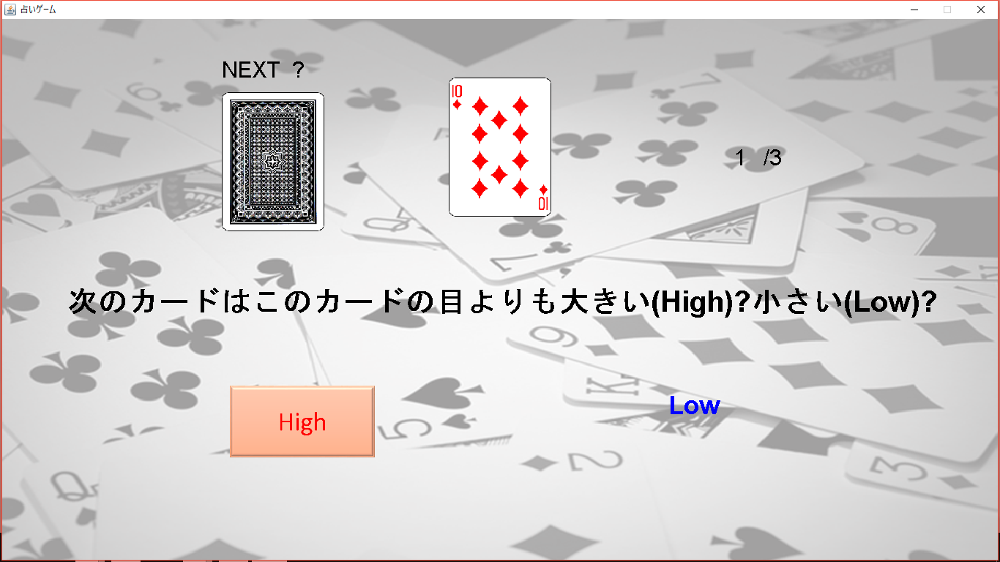
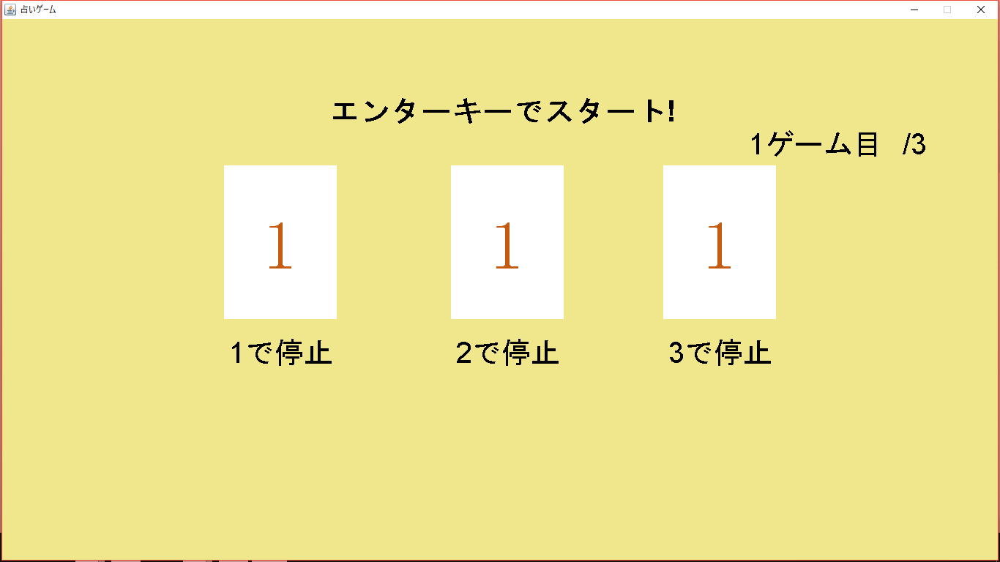

# Uranai_game

## 概要
　誰でも手軽に運試しを行うことができるゲームです。ハイ＆ロー、スロット、おみくじの3つのミニゲームを収録しています。

## 操作方法
　基本的に使用するキーは矢印 (←→) キーとエンターキーだけです。メニュー画面で遊びたいゲームを矢印キーで選びエンターキーで決定するとゲームが開始されます。
 　各ゲームについて、
・High&Low:遊ぶ回数を選択し、ゲーム中は次に来るカードの数字が表示されているものよりも大きいか小さいかを予想・選択していきます。
・おみくじ:4 つの色から好きな色を選択すると占いが始まります。
・スロット:遊ぶ回数と難易度を選択し、ゲーム中はエンターキーでリールを回転、123 キーで各リールを止めることが出来ます。
また各画面において s キーを素早く 10 回押すと設定画面に入ることが出来ます。ここではセーブデータの確認・管理等を行うことが出来ます。

  
